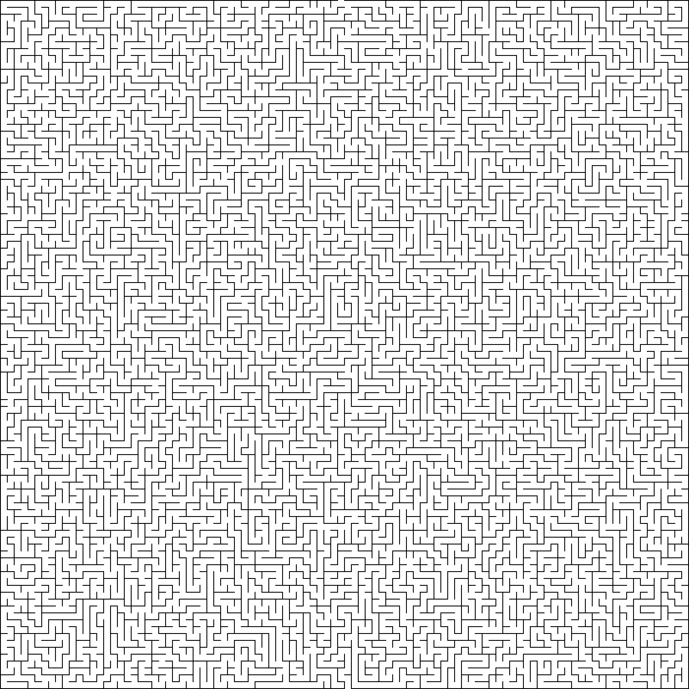

# CVMazeRunner
A python program that uses OpenCV to process and solve an image of a maze

On long car trips as a kid I used to love to solve mazes to pass the time. Now, as a programmer, I'm hoping to give my laptop a similar experience. 

The program can solve the mazes in the test images folder. Currently, it runs a little bit slow, but I'm hoping to optimize the algorithm in the near future.

To try it out for yourself, simply run the setup.py file. You will be prompted for a png maze file. Feel free to try those included in the test images folder, or try out your own images. From there, you can select your own start/end points. Alternately, you can let the program pick for you. It's default start points are either the first opening in the top and bottom of the maze or the midpoint of the top and bottom of the maze. 

I hope you enjoy trying out this program!

Sample Maze:

