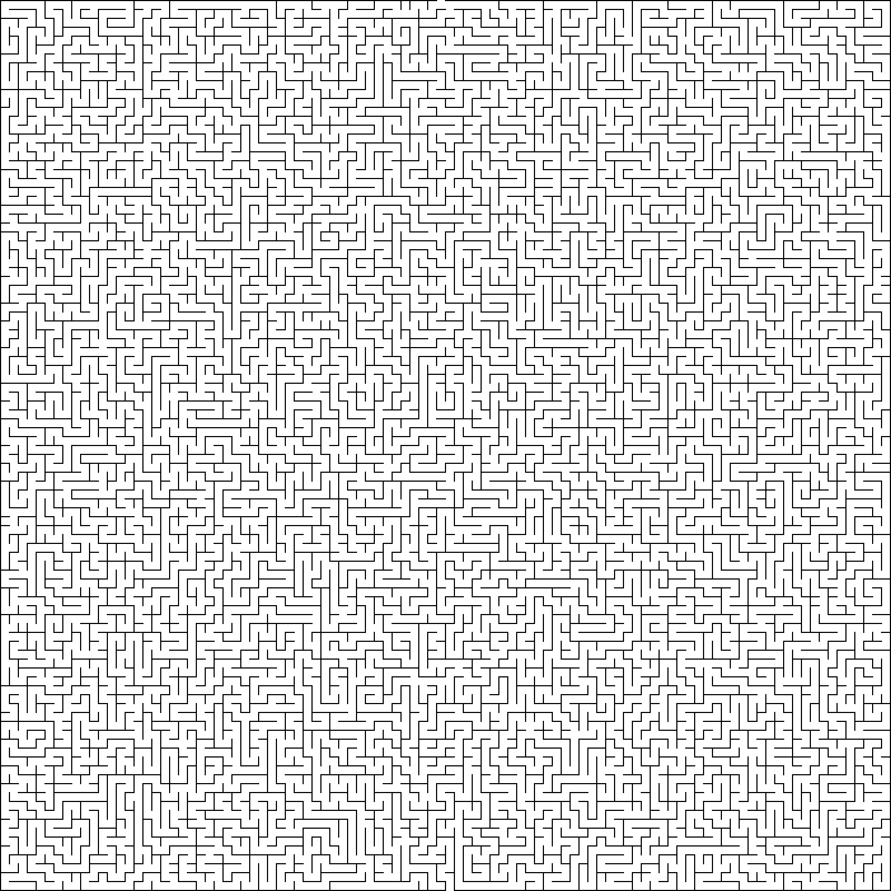

# CVMazeRunner
A python program that uses OpenCV to process and solve an image of a maze

On long car trips as a kid I used to love to solve mazes to pass the time. Now, as a programmer, I'm hoping to give my laptop a similar experience. 

The goal of this project is simple. Taking a randomly generate image of a maze, CVMazeRunner will process the image using OpenCV and find the most efficient route through the maze 

I'm going to be using mazegenerator.net to create the mazes. As a start, I'm going to use a simple square based orthoganal mazes, but I hope to refine my algorithm to handle more advanced algorithms

Sample Maze:

